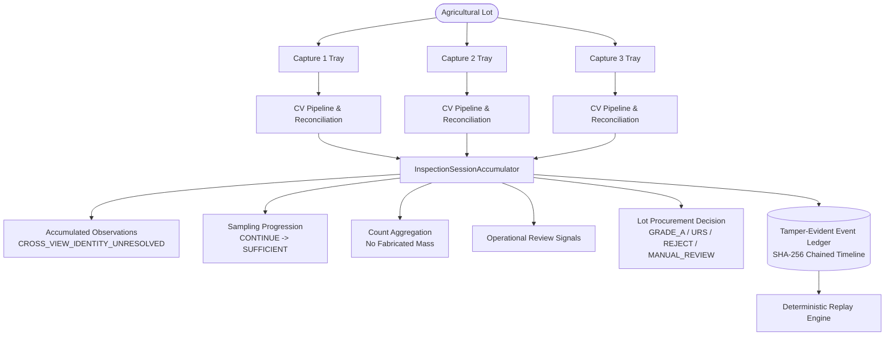

# Mandi Nyaay — Gate 6A Readiness Report
## Multi-Capture Lot Inspection Engine

---

### 1. Architecture

Gate 6A transitions Mandi Nyaay from a single-photograph prototype to a production **Multi-Capture Lot Inspection Engine**. A procurement inspection at an Indian Mandi rarely involves only one photo; an agricultural lot is evaluated across multiple produce trays or surface views.

The engine coordinates the end-to-end accumulation lifecycle:

$$\text{LOT} \longrightarrow \text{CAPTURE 1} \longrightarrow \text{CAPTURE 2} \longrightarrow \dots \longrightarrow \text{ACCUMULATED OBSERVATIONS} \longrightarrow \text{SAMPLING PROGRESSION} \longrightarrow \text{LOT DECISION} \longrightarrow \text{HASHED EVENT LEDGER} \longrightarrow \text{REPLAY}$$



---

### 2. Session State Model

The accumulator maintains an immutable, versioned state machine encapsulated in [`InspectionSession`](file:///c:/Users/S/OneDrive/Desktop/AI/app/domain/inspection_session.py):
- **`session_id`**: Unique session UUID.
- **`lot_id`**: Associated Mandi lot identifier.
- **`status`**: Typed lifecycle state (`IN_PROGRESS`, `COMPLETED`, `MANUAL_REVIEW`, `INVALID`).
- **`captures`**: Monotonically appended list of [`InspectionCapture`](file:///c:/Users/S/OneDrive/Desktop/AI/app/domain/inspection_session.py) objects.
- **`observation_set`**: Cumulative physical produce observations across all captures.
- **`sampling_result`**: Current statistical sampling determination (`CONTINUE`, `SUFFICIENT`, `MANUAL_REVIEW`, `INVALID`).
- **`aggregation`**: Count distribution across all accumulated observations.
- **`review_signals`**: Active operational review signals.
- **`decision`**: Lot-level procurement decision.
- **`evidence_summary`**: Tamper-evident summary with root SHA-256 digest.

---

### 3. Capture Accumulation & Cross-Capture Identity Safety

#### Immutability Guarantee:
Prior capture records are preserved immutably. When Capture $N$ is appended, Capture $1 \dots N-1$ records, raw detection counts, reconciled counts, and observation IDs remain strictly unchanged.

#### Cross-Capture Identity Safety:
The system **never assumes** that a bulb appearing in Capture 2 is identical to or distinct from a bulb in Capture 1 without physical stereo calibration or verified tracking:
- Every accumulated observation explicitly records `cross_view_identity_status = "CROSS_VIEW_IDENTITY_UNRESOLVED"`.
- Both observations are retained in the session observation set.
- The system **never silently deduplicates across captures**.
- Prioritizes mathematical correctness and audit transparency over speculative re-identification heuristics.

---

### 4. Sampling Progression

Sampling sufficiency is dynamically evaluated after each capture against the configured target sample size ($N_{\text{target}}$):

$$\text{Sufficiency Condition}: \quad n_{\text{observed}} \ge N_{\text{target}} \quad \land \quad n_{\text{conflicts}} = 0 \quad \land \quad \text{quality} \ne \text{FAIL}$$

#### Transition Lifecycle:
1. **`CONTINUE`**: $0 < n_{\text{observed}} < N_{\text{target}}$ and $n_{\text{conflicts}} = 0$. Explains exact shortfall: *"Observed sample size (10) is below required target sample size (25). Additional 15 bulb observation(s) required from subsequent captures."*
2. **`SUFFICIENT`**: $n_{\text{observed}} \ge N_{\text{target}}$ and $n_{\text{conflicts}} = 0$. Authorizes deterministic procurement grading.
3. **`MANUAL_REVIEW`**: $n_{\text{conflicts}} > 0$. Any overlapping detection conflict flags the entire sample for human inspector review.
4. **`INVALID`**: Photographic quality screening fails (`FAIL`) or zero observations detected.

The accumulator maintains an explicit `sampling_progression` log capturing every transition step.

---

### 5. Session Aggregation

The aggregation engine computes cumulative defect distributions strictly from physical bulb observation counts:
- `total_observations`: Total accumulated physical bulbs.
- `healthy_count`, `damaged_count`, `sprouted_count`, `rotten_count`.
- `class_conflict_count`: Count of cross-class conflict bulbs.
- `unresolved_identity_count`: Total observations retaining unresolved multi-view status.

#### Mass Guardrail:
- `aggregation_mode = "COUNT_BASED"`
- `mass_status = "UNVALIDATED"`
- `mass_distribution = None`
- **Strict Policy**: The engine never silently substitutes count for mass. Direct mass-based settlement remains blocked until calibrated physical weighbridge/load-cell instrumentation is validated.

---

### 6. Conflict Handling

Detection conflicts occurring in *any* capture remain strictly active and blocking at the lot level:
- If Capture 1 introduces a `CLASS_CONFLICT` (e.g. 0.49 damaged vs 0.48 sprouted on a single bulb), the conflict count is accumulated into the lot observation set.
- Subsequent clean captures do **not** dilute or erase the conflict.
- The lot decision routes directly to `MANUAL_REVIEW` with blocking reasons:
  `['Cross-class detection conflict detected on 1 or more physical bulbs; manual adjudication required.']`
- Resolving conflicts requires explicit inspector manual adjudication via the override flow.

---

### 7. Chronological Event Ledger

The accumulator records every lifecycle change in an immutable cryptographic event timeline ([`app/domain/event_ledger.py`](file:///c:/Users/S/OneDrive/Desktop/AI/app/domain/event_ledger.py)):

#### Event Types:
1. `SESSION_STARTED`
2. `SOURCE_SELECTED`
3. `CAPTURE_ADDED`
4. `OBSERVATIONS_RECONCILED`
5. `SAMPLING_UPDATED`
6. `AGGREGATION_UPDATED`
7. `REVIEW_SIGNAL_EMITTED`
8. `DECISION_UPDATED`
9. `SESSION_COMPLETED`

#### Cryptographic Hash Chaining:
Each event $E_i$ is cryptographically bound to its predecessor $E_{i-1}$:
$$\text{payload\_hash}_i = \text{SHA256}(\text{CanonicalJSON}(\text{payload}_i))$$
$$\text{event\_hash}_i = \text{SHA256}(\text{event\_hash}_{i-1} \,\|\, \text{payload\_hash}_i \,\|\, \text{event\_type}_i \,\|\, \text{timestamp}_i \,\|\, \text{seq}_i)$$
Genesis event uses $\text{event\_hash}_0 = \text{"0"}^{64}$.

The `verify_integrity()` engine checks sequence monotonic order, payload hash authenticity, and previous event hash continuity across the entire ledger.

---

### 8. Deterministic Replay Verification

The standalone [`replay_session(events)`](file:///c:/Users/S/OneDrive/Desktop/AI/app/domain/session_accumulator.py#L464-L589) engine reconstructs the entire inspection session state solely from the event ledger:
1. **Chain Verification**: Validates cryptographic hashes. If any byte was modified, replay halts immediately with a tamper detection exception.
2. **State Machine Reconstruction**: Rebuilds captures, observation set, sampling result, count distribution, review signals, procurement decision, and evidence summary.
3. **Exact Equivalence**:
   $$\text{Original Session State} \equiv \text{Replayed Session State}$$
   Verified across all tests and real CLI executions.

---

### 9. Real Multi-Capture Execution Results

Executed using genuine validation images from `merged_v2/valid/images` with `onion-grading-v7.pt`.

#### Scenario A: Normal Multi-Capture Progression (3 Dense Images)
- **Input Images**:
  1. `densepile_valid_0000.jpg` (10 raw, 10 reconciled, 0 conflicts)
  2. `densepile_valid_0005.jpg` (11 raw, 11 reconciled, 0 conflicts)
  3. `densepile_valid_0006.jpg` (17 raw, 17 reconciled, 0 conflicts)
- **Target Sample Size**: 25 bulbs
- **Progression Observed**:
  - **Capture 1**: 10 bulbs $\longrightarrow$ Sampling: `CONTINUE` (shortfall: 15) $\longrightarrow$ Decision: `MANUAL_REVIEW`
  - **Capture 2**: 21 cumulative bulbs $\longrightarrow$ Sampling: `CONTINUE` (shortfall: 4) $\longrightarrow$ Decision: `MANUAL_REVIEW`
  - **Capture 3**: 38 cumulative bulbs $\ge 25 \longrightarrow$ Sampling: `SUFFICIENT` $\longrightarrow$ Decision: `REJECT` (`DECIDED`)
- **Final Decision**: `REJECT` (5 rotten bulbs = 13.2% $> 2.0\%$ allowable threshold).
- **Ledger Verification**: 23 chained events verified intact.
- **Deterministic Replay**: **PASSED** (`replayed == original`).
- **Artifacts**: [`artifacts/gate6/multicapture_scenario_a.json`](file:///c:/Users/S/OneDrive/Desktop/AI/artifacts/gate6/multicapture_scenario_a.json), [`artifacts/gate6/replay_scenario_a.json`](file:///c:/Users/S/OneDrive/Desktop/AI/artifacts/gate6/replay_scenario_a.json).

#### Scenario B: Conflict Retention Multi-Capture
- **Input Images**:
  1. `cropbad_20230121_084837_train_4551f94b_1.jpg` (2 raw, 1 reconciled, 1 conflict)
  2. `densepile_valid_0000.jpg` (10 raw, 10 reconciled, 0 conflicts)
  3. `densepile_valid_0005.jpg` (11 raw, 11 reconciled, 0 conflicts)
- **Target Sample Size**: 20 bulbs
- **Progression Observed**:
  - **Capture 1**: 1 bulb, 1 conflict $\longrightarrow$ Sampling: `MANUAL_REVIEW` $\longrightarrow$ Decision: `MANUAL_REVIEW`
  - **Capture 2**: 11 bulbs, 1 conflict $\longrightarrow$ Sampling: `MANUAL_REVIEW` $\longrightarrow$ Decision: `MANUAL_REVIEW`
  - **Capture 3**: 22 bulbs ($> 20$), 1 conflict $\longrightarrow$ Sampling: `MANUAL_REVIEW` $\longrightarrow$ Decision: `MANUAL_REVIEW`
- **Result**: Even though cumulative bulbs exceeded the target sample size (22 $\ge 20$), the conflict from Capture 1 remained strictly active. The system did **not** silently resolve or bury the conflict.
- **Artifacts**: [`artifacts/gate6/multicapture_scenario_b.json`](file:///c:/Users/S/OneDrive/Desktop/AI/artifacts/gate6/multicapture_scenario_b.json), [`artifacts/gate6/replay_scenario_b.json`](file:///c:/Users/S/OneDrive/Desktop/AI/artifacts/gate6/replay_scenario_b.json).

---

### 10. Status Matrix

```
┌─────────────────────────────────────────────────────────────────────────────┐
│                      GATE 6A READINESS STATUS MATRIX                        │
├──────────────────────────┬──────────────────────────────────────────────────┤
│ IMPLEMENTED              │ - InspectionSessionAccumulator (Gate 6A-1)       │
│                          │ - Cross-Capture Identity Safety (Gate 6A-2)      │
│                          │ - Dynamic Multi-Capture Sampling (Gate 6A-3)     │
│                          │ - Multi-Capture Count Aggregator (Gate 6A-4)     │
│                          │ - Lot-Level Decision Recomputation (Gate 6A-5)  │
│                          │ - Chronological SHA-256 Ledger (Gate 6A-6)       │
│                          │ - Deterministic Replay Engine (Gate 6A-7)        │
│                          │ - Multi-Capture CLI Demo Runner (Gate 6A-10)     │
├──────────────────────────┼──────────────────────────────────────────────────┤
│ VALIDATED                │ - Zero silent cross-capture deduplication        │
│                          │ - Monotonic capture immutability                 │
│                          │ - CONTINUE -> SUFFICIENT real progression        │
│                          │ - Conflict retention across captures             │
│                          │ - Cryptographic hash chain & tamper detection    │
│                          │ - Deterministic replay equivalence               │
│                          │ - 85 passing automated tests in pytest suite     │
├──────────────────────────┼──────────────────────────────────────────────────┤
│ UNVALIDATED              │ - Cross-camera visual re-identification          │
│                          │ - 3D produce equatorial diameter from 2D planar  │
│                          │ - Single-view volumetric mass density models     │
├──────────────────────────┼──────────────────────────────────────────────────┤
│ BLOCKED                  │ - Direct mass-based procurement settlement       │
│                          │   (Blocked on physical load-cell ground truth)   │
└──────────────────────────┴──────────────────────────────────────────────────┘
```

---

### 11. Exact Flutter-Facing Data Contract

The accumulated multi-capture session payload matches the following machine-readable structure:

```json
{
  "session": {
    "session_id": "ses_12fb938e",
    "lot_id": "lot_scenario_a_normal",
    "status": "COMPLETED",
    "pipeline_version": "0.1.0"
  },
  "captures": [
    {
      "capture_id": "cap_lot_001",
      "image_path": "path/to/densepile_valid_0000.jpg",
      "image_sha256": "6de8cbb2206d4c59...",
      "raw_detection_count": 10,
      "reconciled_observation_count": 10,
      "conflict_count": 0,
      "quality_status": "WARN",
      "observation_ids": ["obs_0", "obs_1", "..."],
      "model_version": "onion-grading-v7.pt"
    }
  ],
  "sampling_progression": [
    {
      "capture_id": "cap_lot_001",
      "capture_index": 1,
      "observed_sample_size": 10,
      "target_sample_size": 25,
      "status": "CONTINUE",
      "reason": "Observed sample size (10) is below required target sample size (25). Additional 15 bulb observation(s) required from subsequent captures."
    },
    {
      "capture_id": "cap_lot_003",
      "capture_index": 3,
      "observed_sample_size": 38,
      "target_sample_size": 25,
      "status": "SUFFICIENT",
      "reason": "Observed sample size (38) meets or exceeds the target sample size (25) with zero unresolved cross-class conflicts."
    }
  ],
  "aggregation": {
    "aggregation_mode": "COUNT_BASED",
    "total_observations": 38,
    "healthy_count": 20,
    "damaged_count": 10,
    "sprouted_count": 3,
    "rotten_count": 5,
    "class_conflict_count": 0,
    "unresolved_identity_count": 38,
    "mass_status": "UNVALIDATED",
    "mass_distribution": null
  },
  "decision": {
    "decision_id": "dec_c5e89d12",
    "status": "DECIDED",
    "procurement_grade": "REJECT",
    "decision_rule_version": "MANDI_NYAAY_PROCUREMENT_RULES_V1.0",
    "decision_reasons": ["Rotten proportion (13.2%) exceeds maximum allowable limit (2.0%)."],
    "blocking_reasons": [],
    "input_capture_ids": ["cap_lot_001", "cap_lot_002", "cap_lot_003"]
  },
  "evidence": {
    "evidence_root_hash": "549a87c1aacc9af9a0d226e29deaad1cadad97fc5e64166aeb606d2970611773",
    "evidence_ledger_term": "tamper-evident/replayable"
  }
}
```

---

### 12. Next Gate: Gate 6B — Blind Resampling & Dispute Protocol

1. **Blind Resampling Session Isolation**: Initiate secondary inspection blinded to the first inspector's counts, defect ratings, and decision.
2. **Reconciliation Engine**: Automated statistical comparison of primary vs secondary session distributions.
3. **Dispute Resolution Logging**: Record joint arbitration outcomes directly into the chained event ledger.
