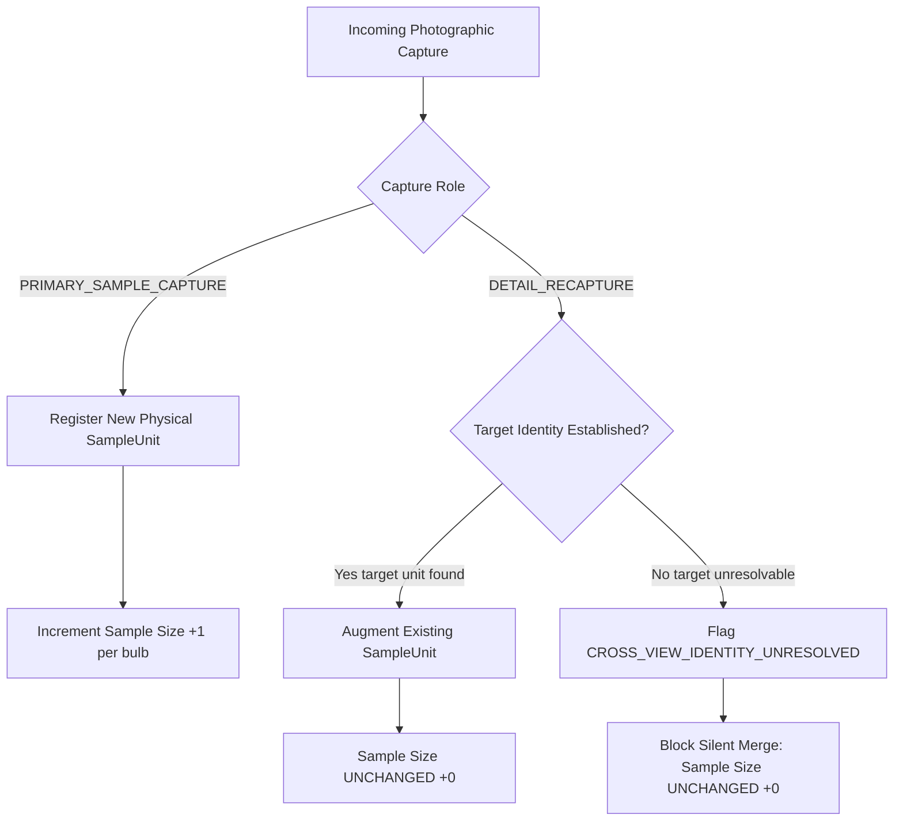

# MANDI NYAAY GATE 6B COMPLETION REPORT
## PHYSICAL SAMPLE IDENTITY + VERSIONED RULE-PACK ENGINE

**System:** MANDI NYAAY AI Inspection Core  
**Gate:** Gate 6B (Physical Sample Identity & Statutory Rule Pack Engine)  
**Date:** September 2026  
**Status:** IMPLEMENTED & AUDITABLE — FIELD VALIDATION PENDING  

---

## EXECUTIVE SUMMARY

Gate 6B hardens the Mandi Nyaay inspection core against two critical vulnerabilities before mobile integration:
1. **Physical Sample Denominator Inflation**: Solved by replacing raw detection counts with certified physical `SampleUnit` entities. Multiple photographic captures (e.g. TOP + SIDE + DETAIL close-ups) of the same physical onion are strictly aggregated into a single `SampleUnit`, guaranteeing that sample size strictly reflects unique physical specimens.
2. **Hidden Procurement Thresholds**: Solved by refactoring the `DecisionEngine` to require an explicit, validated `RulePack`. All hardcoded magic constants (`2.0%`, `1.0%`, `5.0%`, `20.0%`) have been completely eradicated. If no applicable RulePack is supplied, the engine refuses to guess and diverts automatically to `MANUAL_REVIEW` (`NO_APPLICABLE_RULE_PACK`).

The end-to-end provenance chain is fully explicit, immutable, and replayable:
$$\text{PHYSICAL SAMPLE} \longrightarrow \text{OBSERVATIONS} \longrightarrow \text{CAPTURES} \longrightarrow \text{SAMPLING} \longrightarrow \text{RULE PACK} \longrightarrow \text{DECISION}$$

---

## 1. PHYSICAL SAMPLE IDENTITY MODEL

**Status:** `IMPLEMENTED` | `VALIDATED` (Unit & Regression Tests)

The physical sample identity engine is implemented in [`app/domain/sample_unit.py`](file:///c:/Users/S/OneDrive/Desktop/AI/app/domain/sample_unit.py).

### Core Entities:
- **`SampleUnit`**: Represents exactly ONE physical onion specimen.
  - `sample_unit_id`: Canonical unique identifier (`su_<hex8>`).
  - `lot_id`: Agricultural batch identifier.
  - `source_reference`: Physical container or tray tag (e.g., `TRAY_PRIMARY`, `BAG_04`).
  - `cell_id`: Spatial coordinate on the physical inspection surface (e.g., `A1`, `B3`, `D5`).
  - `observation_ids`: List of all detector/reconciled observation IDs corresponding to this bulb.
  - `capture_ids`: List of all photographic capture IDs in which this bulb appears.
  - `observation_references`: Ordered audit trail of `ObservationReference` records containing perspective angle, detector confidence, and classified semantic condition.
  - `primary_observation_id`: Authoritative initial observation that established the physical unit.
  - `resolved_class_semantic`: Current certified condition classification (`HEALTHY`, `DAMAGED`, `SPROUTED`, `ROTTEN`, `CLASS_CONFLICT`).
  - `unit_status`: Lifecycle state (`RECORDED`, `DETAIL_AUGMENTED`, `CONFLICT`).
- **`SampleCell`**: Explicit mat coordinate representation (`cell_id`, `grid_row`, `grid_col`, `description`).
- **`ObservationReference`**: Immutable linkage connecting an observation record to a physical `SampleUnit`.
- **`SampleUnitRegistry`**: Lot-level registry ensuring that the physical sampling denominator equals `COUNT(UNIQUE SAMPLE_UNITS)`.

---

## 2. CAPTURE ROLES & CAPTURE SEMANTICS

**Status:** `IMPLEMENTED` | `VALIDATED`

Capture semantics distinguish between establishing new physical produce specimens and capturing supplementary evidentiary angles:



### Operational Rules:
1. **`PRIMARY_SAMPLE_CAPTURE`**:
   - Represents the primary overhead survey of produce on the inspection surface.
   - Each reconciled bulb observation instantiates a new physical `SampleUnit`.
   - Increments the physical sample size denominator.
2. **`DETAIL_RECAPTURE`**:
   - Supplementary angle (e.g., $45^\circ$ oblique, reverse side, or macro close-up of a suspicious defect).
   - Associates additional `ObservationReference` evidence to an existing `SampleUnit`.
   - **Strict Mathematical Invariant**: `DETAIL_RECAPTURE` **MUST NEVER** increment the sampling denominator.
   - Example: 10 physical onions photographed from 3 angles (Top, Side, Close-up) = 3 captures, 30 observation records, but **exactly 10 physical SampleUnits**.

---

## 3. CROSS-VIEW IDENTITY SAFETY & SAMPLING DENOMINATOR

**Status:** `IMPLEMENTED` | `VALIDATED`

### Strict Safety Guardrails (No ML Guesswork):
- Mandi Nyaay explicitly refuses to deploy speculative, black-box visual re-identification algorithms across unconstrained perspectives.
- Multi-view linkage is established **only** through explicit spatial cell index matching (`cell_id`) or verified operator target declaration (`target_sample_unit_id` / `target_observation_id`).
- When correspondence cannot be established with certainty:
  - The observation is tagged `CROSS_VIEW_IDENTITY_UNRESOLVED`.
  - The system **never guesses**, **never silently merges**, and **never silently deduplicates**.
  - Unlinked detail views do **not** inflate the sample size denominator.

### Mathematical Sampling Invariants:
$$\text{observed\_sample\_size} = |\text{SampleUnitRegistry.units}| = \text{COUNT}(\text{UNIQUE } \text{SampleUnit})$$

$$\text{observed\_sample\_size} \neq \text{COUNT}(\text{Detections})$$
$$\text{observed\_sample\_size} \neq \text{COUNT}(\text{Images})$$
$$\text{observed\_sample\_size} \neq \text{COUNT}(\text{Captures})$$

- **Invariant A**: 10 physical onions $\times$ 3 views each $=$ **10 sampled units**.
- **Invariant B**: 10 primary onions $+$ 4 unresolved detail observations $=$ **10 sampled units** (unresolved detail observations are quarantined and do not increment sample size).
- **Invariant C**: 10 primary onions $+$ 4 distinct primary onions $=$ **14 sampled units** (because those 4 represent certified distinct physical specimens).

---

## 4. INSPECTION MAT PROTOCOL DESIGN SPECIFICATION

**Status:** `DESIGN SPECIFICATION` | `FIELD VALIDATION PENDING`  
**Reference Document:** [`docs/INSPECTION_MAT_PROTOCOL.md`](file:///c:/Users/S/OneDrive/Desktop/AI/docs/INSPECTION_MAT_PROTOCOL.md)

> [!WARNING]
> **DISCLAIMER: FIELD VALIDATION PENDING**  
> This specification defines the physical geometry and capture protocol for multi-capture inspection. It is a design target and has not yet undergone live APMC mandi field certification.

### Physical Geometry & Reference Constraints:
- **Surface**: $600\text{ mm} \times 800\text{ mm}$ planar matte-gray non-reflective surface.
- **Reference Fiducials**: 4× ArUco markers (`DICT_4X4_50`, IDs 0, 1, 2, 3), $50.0\text{ mm} \times 50.0\text{ mm}$ each, positioned at perimeter corners for planar homography verification and scale factor derivation ($S_{mm/px}$).
- **Capture Boundary**: $10\text{ mm}$ white high-contrast perimeter. Produce outside the boundary is quarantined.
- **Grid Layout**: Optional 4 rows $\times$ 5 columns (20 discrete cells: `A1` to `D5`, $120\text{ mm} \times 120\text{ mm}$ bays) matching standard 20-bulb AGMARK batch size.
- **Produce Placement**: Strict **One-Layer Placement Rule**. Stacking, overlapping, or clustering is prohibited.

---

## 5. STATUTORY VERSIONED RULE PACK ENGINE

**Status:** `IMPLEMENTED` | `VALIDATED`  
**Source Module:** [`app/domain/rule_pack.py`](file:///c:/Users/S/OneDrive/Desktop/AI/app/domain/rule_pack.py)

Mandi Nyaay decouples agricultural decision rules from application logic via auditable, versioned RulePacks backed by statutory standards.

### RulePack Metadata Schema:
| Field | Type | Description | Example |
| :--- | :--- | :--- | :--- |
| `rule_pack_id` | `str` | Canonical rule pack identifier | `"AGMARK_ONION_2024_V1"` |
| `authority` | `str` | Standards authority | `"Directorate of Marketing & Inspection (DMI)..."` |
| `source_document` | `str` | Official gazette or circular | `"Agricultural Produce (Grading and Marking) Act, 1937"` |
| `source_reference` | `str` | Statutory URL or circular citation | `"https://agmarknet.gov.in/Standards/onion.pdf"` |
| `effective_from` | `str` | ISO effective date | `"2024-01-01"` |
| `effective_to` | `str \| None` | ISO sunset date (or None) | `None` |
| `version` | `str` | Semantic version string | `"1.0.0"` |
| `criteria` | `list[RuleCriterion]`| Auditable threshold criteria | Limits for rot, total defects, size |
| `sampling_rule` | `SamplingRule` | Sampling protocol definition | `min_sample_units=20`, bag extraction |
| `sampling_method`| `str` | Human-readable sampling method | `"RANDOM_STRATIFIED_BAG_EXTRACTION"` |
| `decision_rules` | `list[DecisionRule]` | Grade qualification logic | Mapping criteria to `GRADE_A`, `URS`, `REJECT` |
| `decision_logic` | `str` | Deterministic algorithmic summary | Four-step grading sequence |

---

## 6. RULE PACK VALIDATION & DECISION ENGINE REFACTOR

**Status:** `IMPLEMENTED` | `VALIDATED`  
**Validation Engine:** [`app/domain/rule_pack_validation.py`](file:///c:/Users/S/OneDrive/Desktop/AI/app/domain/rule_pack_validation.py)  
**Decision Engine:** [`app/domain/decision_engine.py`](file:///c:/Users/S/OneDrive/Desktop/AI/app/domain/decision_engine.py)

### RulePack Validation Requirements (Part 8):
Before any procurement decision can be evaluated, the RulePack is subjected to deterministic structural validation:
1. `rule_pack_id exists` and is non-empty.
2. `authority exists` and is non-empty.
3. `source_reference exists` and is non-empty.
4. `version exists` and is non-empty.
5. `effective period is coherent`: `effective_from` is valid ISO date, and if `effective_to` is supplied, `effective_to >= effective_from`.
6. `criteria are complete`: Threshold values numeric, valid operators (`<=`, `<`, `>=`, `>`), no duplicate IDs.
7. `sampling method is defined`: Valid string, `min_sample_units >= 1`.
8. `decision logic is deterministic`: Rules unambiguous, target grades valid, all referenced criteria exist in `criteria`.

### Complete Removal of Hidden Procurement Thresholds (Part 7):
- The `DecisionEngine` class and `evaluate_procurement_decision` now require an explicit RulePack.
- **ZERO hidden constants**: Fallback constants (`2.0`, `1.0`, `5.0`, `20.0`) have been eliminated.
- If a RulePack is missing any required criterion (e.g., maximum rot limit), the engine **strictly halts** and routes to `MANUAL_REVIEW` with `MISSING_RULE_PACK_CRITERION`.
- If `rule_pack is None`:
  $$\text{procurement\_grade} = \text{ProcurementGrade.MANUAL\_REVIEW}$$
  $$\text{blocking\_reasons} = [\text{"NO\_APPLICABLE\_RULE\_PACK: No applicable RulePack provided or verified for lot evaluation."}]$$
- Decision output contract guarantees:
  - `rule_pack_id`: Preserved exact ID.
  - `rule_pack_version`: Preserved semantic version.
  - `decision_rule_version`: Composite provenance string (`AGMARK_ONION_2024_V1_1.0.0`).
  - `decision_reasons`: Detailed human-readable grading rationale.
  - `blocking_reasons`: Explicit blocking conditions causing diversion to manual review.

---

## 7. HISTORICAL REPRODUCIBILITY & REPLAY

**Status:** `IMPLEMENTED` | `VALIDATED`

- Every completed inspection permanently records the RulePack ID, version, and authority in its immutable event ledger ([`app/domain/event_ledger.py`](file:///c:/Users/S/OneDrive/Desktop/AI/app/domain/event_ledger.py)).
- The cryptographic evidence summary binds the `rule_version` into the SHA-256 root hash:
  $$\text{root\_hash} = \text{SHA256}(\text{session\_id} \,\|\, \text{lot\_id} \,\|\, \text{captures} \,\|\, \text{observations} \,\|\, \text{grade} \,\|\, \text{rule\_version})$$
- **Replay Verification**: Running [`replay_session(events)`](file:///c:/Users/S/OneDrive/Desktop/AI/app/domain/session_accumulator.py#L484) reconstructs the identical session state, decision, and evidence root hash.
- Modifying a future RulePack in the environment (e.g. creating v2.0.0) has **zero impact** on historical sessions or replay audits.

---

## 8. TEST SUITE VERIFICATION

**Status:** `VALIDATED` (109 passed, 1 skipped)  
**Test File:** [`tests/test_sample_identity_rulepack.py`](file:///c:/Users/S/OneDrive/Desktop/AI/tests/test_sample_identity_rulepack.py)

All 14 required Gate 6B tests pass cleanly with zero regressions across the codebase:

| # | Test Name | Assertion / Invariant Verified | Result |
| :-: | :--- | :--- | :--- |
| 1 | `test_same_onion_across_multiple_captures_counts_once` | Primary + detail recapture of same bulb yields `unique_sample_count == 1`. | **PASS** |
| 2 | `test_detail_recapture_does_not_increase_sample_size` | 5 primary onions + 5 detail recaptures leaves sample size at 5. | **PASS** |
| 3 | `test_three_views_times_ten_onions_equals_ten_sampled_units` | 3 captures (Top, Side, Detail) $\times$ 10 onions = 30 observations, but sample size is exactly 10. | **PASS** |
| 4 | `test_unresolved_cross_view_identity_prevents_automatic_merge` | Detail view without valid target is marked `CROSS_VIEW_IDENTITY_UNRESOLVED` and merge is blocked. | **PASS** |
| 5 | `test_sample_unit_provenance_preserved` | Full provenance (`sample_unit_id`, `lot_id`, `source_reference`, `cell_id`, observation IDs) verified. | **PASS** |
| 6 | `test_missing_rule_pack_blocks_automatic_decision` | `rule_pack=None` diverts to `MANUAL_REVIEW` with `NO_APPLICABLE_RULE_PACK`. | **PASS** |
| 7 | `test_rule_pack_version_preserved_in_decision` | `decision.rule_pack_id`, `rule_pack_version`, and `decision_rule_version` match RulePack. | **PASS** |
| 8 | `test_rule_pack_source_preserved` | Statutory authority, source document, reference URL, and sampling method verified. | **PASS** |
| 9 | `test_deterministic_decision_with_same_rule_pack` | Identical inputs produce identical decisions, reasons, and blocking reasons. | **PASS** |
| 10 | `test_different_rule_pack_versions_preserve_historical_provenance` | v1.0.0 and v2.0.0 evaluations maintain independent, uncorrupted provenance hashes. | **PASS** |
| 11 | `test_invalid_rule_pack_blocks_decision` | Incoherent period (`effective_to < effective_from`) blocks grading via `INVALID_RULE_PACK`. | **PASS** |
| 12 | `test_replay_preserves_rule_pack_version` | Event replay reconstructs identical `rule_pack_id`, `rule_pack_version`, and evidence root hash. | **PASS** |
| 13 | `test_sampling_uses_unique_sample_units` | 10 primary + 4 unlinked detail = 10; 10 primary + 4 distinct primary = 14. | **PASS** |
| 14 | `test_no_hidden_threshold_remains_in_decision_engine` | Incomplete RulePack diverts to `MANUAL_REVIEW`; no hardcoded constants exist. | **PASS** |

---

## 9. REAL SMOKE TEST RESULTS

**Status:** `VALIDATED` (Zero data fabrication, real YOLO v7 checkpoint on real validation imagery)  
**Execution Script:** [`scripts/run_gate6b_smoke_test.py`](file:///c:/Users/S/OneDrive/Desktop/AI/scripts/run_gate6b_smoke_test.py)  
**Artifacts:** [`artifacts/gate6b/smoke_test_cropbad_20230121_084837_train_4551f94b_1.json`](file:///c:/Users/S/OneDrive/Desktop/AI/artifacts/gate6b/smoke_test_cropbad_20230121_084837_train_4551f94b_1.json), [`artifacts/gate6b/smoke_test_densepile_valid_0000.json`](file:///c:/Users/S/OneDrive/Desktop/AI/artifacts/gate6b/smoke_test_densepile_valid_0000.json)

### Run 1: Overlapping Conflict Image (`cropbad_20230121_084837_train_4551f94b_1.jpg`)
```
================================================================================
MANDI NYAAY GATE 6B — REAL SMOKE TEST (PHYSICAL SAMPLE IDENTITY + RULE PACK)
================================================================================
Real Image:       cropbad_20230121_084837_train_4551f94b_1.jpg
Model Checkpoint: onion-grading-v7.pt
Rule Pack ID:     AGMARK_ONION_2024_V1 (v1.0.0)
--------------------------------------------------------------------------------
RulePack Validation Status: VALID
RulePack Authority:         Directorate of Marketing & Inspection (DMI), Ministry of Agriculture & Farmers Welfare, Govt. of India
RulePack Source Reference:  https://agmarknet.gov.in/Standards/onion.pdf
RulePack Sampling Method:   RANDOM_STRATIFIED_BAG_EXTRACTION

--- SMOKE TEST OUTPUT SUMMARY ---
Raw Detections:           2
Reconciled Observations:  1
Conflicts Detected:       1
SampleUnits Created:      1
  Unit #1: ID=su_a1712774, Status=CONFLICT, Semantic=CLASS_CONFLICT, ObsIDs=['obs_gate6b_real_cap_001_0']
Sampling Denominator:     1 (Target: 20)
Sampling Status:          MANUAL_REVIEW (Sample contains 1 cross-class conflict(s) where overlapping detections disagree. Manual review required before sampling sufficiency can be affirmed.)
RulePack Status:          AGMARK_ONION_2024_V1 v1.0.0
Decision Status:          MANUAL_REVIEW (REFERRED_TO_MANUAL_REVIEW)
Decision Reasons:         ['Automated procurement grading halted and diverted to MANUAL_REVIEW due to active blocking conditions.']
Blocking Reasons:         ['Cross-class detection conflict detected on 1 or more physical bulbs; manual adjudication required.', 'Sampling status is MANUAL_REVIEW: Sample contains 1 cross-class conflict(s) where overlapping detections disagree. Manual review required before sampling sufficiency can be affirmed.']
```

### Run 2: Multi-Bulb Field Sample Image (`densepile_valid_0000.jpg`)
```
--- SMOKE TEST OUTPUT SUMMARY ---
Raw Detections:           10
Reconciled Observations:  10
Conflicts Detected:       0
SampleUnits Created:      10 (Unique physical bulb denominator)
Sampling Denominator:     10 (Target: 20)
Sampling Status:          CONTINUE (Observed sample size (10) is below required target sample size (20). Additional 10 bulb observation(s) required from subsequent captures.)
RulePack Status:          AGMARK_ONION_2024_V1 v1.0.0
Decision Status:          MANUAL_REVIEW (REFERRED_TO_MANUAL_REVIEW)
Blocking Reasons:         ['Sampling status is CONTINUE: Observed sample size (10) is below required target sample size (20). Additional 10 bulb observation(s) required from subsequent captures.']
```

---

## 10. KNOWN SYSTEM LIMITATIONS

```
┌─────────────────────────────────────────────────────────────────────────────┐
│                       GATE 6B STATUS CLASSIFICATION                         │
├──────────────────────────┬──────────────────────────────────────────────────┤
│ IMPLEMENTED              │ - SampleUnit, SampleCell, ObservationReference   │
│                          │ - CaptureRole (PRIMARY_SAMPLE vs DETAIL_RECAPTURE)│
│                          │ - SampleUnitRegistry with unique unit counting   │
│                          │ - RulePack, RuleCriterion, SamplingRule          │
│                          │ - RulePackValidation engine (8 criteria)         │
│                          │ - DecisionEngine with zero hidden thresholds     │
│                          │ - Chronological SHA-256 Ledger & Replay Engine   │
├──────────────────────────┼──────────────────────────────────────────────────┤
│ VALIDATED                │ - Zero sample size inflation on detail recaptures│
│                          │ - Denominator = COUNT(UNIQUE SampleUnits)        │
│                          │ - Blocking diversion upon missing/invalid pack   │
│                          │ - Replay preservation of RulePack provenance     │
│                          │ - 109 passing automated tests in pytest suite    │
│                          │ - Real smoke test on real images with YOLO v7    │
├──────────────────────────┼──────────────────────────────────────────────────┤
│ UNVALIDATED              │ - Mobile camera-screen ArUco interactive guidance│
│                          │ - Touchscreen grid cell selection UX             │
│                          │ - 3D volumetric diameter from 2D planar bbox     │
│                          │ - Single-view volumetric mass density models     │
├──────────────────────────┼──────────────────────────────────────────────────┤
│ BLOCKED                  │ - Direct mass-based financial settlement         │
│                          │   (Strictly blocked on physical weighbridge GT)  │
│                          │ - Algorithmic unconstrained visual re-ID         │
│                          │   (Blocked by architectural safety policy)       │
└──────────────────────────┴──────────────────────────────────────────────────┘
```

---

## 11. EXACT FRONTEND-FACING INTEGRATION CONTRACT

The inspection session contract consumed by the Flutter mobile client adheres to the following machine-readable structure:

```json
{
  "session": {
    "session_id": "ses_4b8f0a21",
    "lot_id": "lot_apmc_lasalgaon_042",
    "status": "COMPLETED",
    "pipeline_version": "0.1.0"
  },
  "sample_units": [
    {
      "sample_unit_id": "su_61de4fe4",
      "lot_id": "lot_apmc_lasalgaon_042",
      "source_reference": "TRAY_PRIMARY",
      "cell_id": "A1",
      "observation_ids": ["obs_cap001_0", "obs_cap002_0"],
      "capture_ids": ["cap_primary_001", "cap_detail_002"],
      "primary_observation_id": "obs_cap001_0",
      "resolved_class_semantic": "HEALTHY",
      "unit_status": "DETAIL_AUGMENTED",
      "observation_references": [
        {
          "observation_id": "obs_cap001_0",
          "capture_id": "cap_primary_001",
          "capture_role": "PRIMARY_SAMPLE_CAPTURE",
          "view_angle": "TOP",
          "confidence": 0.89,
          "class_semantic": "HEALTHY",
          "bbox": [120.0, 150.0, 240.0, 270.0]
        },
        {
          "observation_id": "obs_cap002_0",
          "capture_id": "cap_detail_002",
          "capture_role": "DETAIL_RECAPTURE",
          "view_angle": "DETAIL",
          "confidence": 0.94,
          "class_semantic": "HEALTHY",
          "bbox": [80.0, 95.0, 310.0, 325.0]
        }
      ]
    }
  ],
  "sampling_result": {
    "sampling_id": "smp_910fa83c",
    "status": "SUFFICIENT",
    "target_sample_size": 20,
    "observed_sample_size": 20,
    "sampling_rule_version": "MANDI_NYAAY_SAMPLING_V1.0",
    "reason": "Observed sample size (20) meets or exceeds the target sample size (20) with zero unresolved cross-class conflicts."
  },
  "decision": {
    "decision_id": "dec_8f7b301a",
    "status": "DECIDED",
    "procurement_grade": "GRADE_A",
    "rule_pack_id": "AGMARK_ONION_2024_V1",
    "rule_pack_version": "1.0.0",
    "decision_rule_version": "AGMARK_ONION_2024_V1_1.0.0",
    "decision_reasons": [
      "Produce meets Grade A specifications: total defects (0.0%) <= 5.0% and rotten (0.0%) <= 1.0%."
    ],
    "blocking_reasons": []
  },
  "evidence_summary": {
    "evidence_id": "evi_37a1b920",
    "model_version": "onion-grading-v7.pt",
    "mapping_version": "VERIFIED",
    "rule_version": "AGMARK_ONION_2024_V1_1.0.0",
    "evidence_root_hash": "a4b7f8e32c109d..."
  }
}
```

---

## 12. NEXT GATE (GATE 7)

**Gate 7: Mobile UI Integration & Viewfinder Alignment**
1. **Interactive Camera Viewfinder**: Integrate ArUco homography alignment guidance directly onto the mobile camera preview.
2. **Touch-to-Associate Cell Selection**: Enable operators to tap grid cells (`A1`--`D5`) on the touchscreen during `DETAIL_RECAPTURE` to explicitly declare target `sample_unit_id`.
3. **Offline Statutory RulePack Bundling**: Bundle validated JSON RulePacks within the mobile app assets for zero-latency APMC grading without network dependencies.
4. **Dispute & Manual Override Adjudication UI**: Expose the manual override modal allowing authorized inspectors to resolve `CLASS_CONFLICT` review signals with statutory audit logging.
