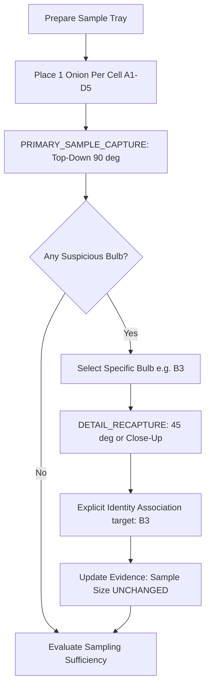

# MANDI NYAAY INSPECTION MAT & PHYSICAL CAPTURE PROTOCOL
**Status:** DESIGN / FIELD VALIDATION PENDING  
**Version:** 1.0.0-PROVISIONAL  
**Target:** Gate 6B Physical Sample Identity & Traceability  

> [!WARNING]
> **DISCLAIMER: FIELD VALIDATION PENDING**  
> This specification defines the physical and operational protocol for multi-capture produce inspection under the Mandi Nyaay system. It has not yet been certified in live agricultural market (APMC/mandi) procurement conditions. Metric calibration and spatial coordinate tracking specified herein represent software domain contracts and design targets.

---

## 1. PURPOSE & PRINCIPLES

1. **Physical Sample Identity Guarantee**: A physical onion is the atomic unit of inspection. Multiple photographic perspectives (e.g., Top, Side, Close-up Detail) of the same bulb MUST NOT inflate the sampling denominator or distort condition percentages.
2. **Deterministic Attribution**: Cross-view observation association is strictly deterministic and explicitly bound via spatial cell indexing or operator annotation.
3. **No Algorithmic Guesswork**: If cross-view correspondence cannot be established with certainty, the observation is tagged `CROSS_VIEW_IDENTITY_UNRESOLVED` and automatic merging is blocked.

---

## 2. PHYSICAL MAT SPECIFICATION (DESIGN CONTRACT)

### 2.1 Mat Surface & Boundaries
- **Dimensions**: 600 mm × 800 mm planar inspection area.
- **Surface**: High-contrast, non-reflective matte gray/black background (anti-glare) to eliminate specular highlights from shed lighting.
- **Outer Boundary**: High-contrast, 10 mm white perimeter border demarcating the active capture zone. Any produce or foreign object outside this boundary is excluded from inspection.

### 2.2 Reference Fiducial Markers
- **Type**: 4× ArUco markers (Dictionary: `DICT_4X4_50`, Marker IDs: 0, 1, 2, 3) positioned at the four corners of the boundary.
- **Physical Size**: 50.0 mm × 50.0 mm square per marker.
- **Function**:
  - Validates optical planar homography and camera tilt angle.
  - Establishes absolute millimeter-to-pixel scale ($S_{mm/px}$).
  - Detects out-of-plane distortion or severe lens perspective skew.

### 2.3 Spatial Grid Cells (Optional Layout)
- **Grid Configuration**: 4 rows × 5 columns (20 discrete cells) designed for standard 20-bulb AGMARK sample batches.
- **Cell Indexing**: Alphanumeric alphanumeric matrix:
  - Row labels: `A`, `B`, `C`, `D`
  - Column labels: `1`, `2`, `3`, `4`, `5`
  - Cell Identifiers: `A1`, `A2`, ..., `D4`, `D5`.
- **Cell Markings**: Subtle, low-contrast dashed lines (2 mm width) forming 120 mm × 120 mm bays.

---

## 3. PRODUCE PLACEMENT RULES

1. **One-Layer Placement Rule**:
   - Bulbs must be placed strictly in a single layer.
   - Stacking, pyramid formation, or partial overlapping is strictly prohibited.
   - Any physical contact between adjacent bulbs should be minimized (target $\ge 15\text{ mm}$ clearance).
2. **Cell Assignment**:
   - Exactly one bulb per grid cell when utilizing the 20-cell grid mat.
   - If gridless mat is used, bulbs must be distributed uniformly within the outer boundary.
3. **Root and Neck Orientation**:
   - Bulbs should be oriented with the equatorial axis horizontal to the mat surface during primary capture.

---

## 4. CAPTURE ROLES & PROCEDURE

### 4.1 Primary Capture (`PRIMARY_SAMPLE_CAPTURE`)
- **Camera Perspective**: Overhead nadir view ($90^\circ \pm 10^\circ$ relative to mat plane).
- **Framing**: All 4 corner ArUco markers and the entire perimeter border must be visible in the camera viewfinder.
- **Role & Action**:
  - Establishes the authoritative baseline physical `SampleUnit` registry.
  - Each detected and reconciled bulb is assigned a unique `sample_unit_id` and linked to its spatial `cell_id`.
  - Increments the observed physical sample size ($N_{\text{sample}}$).

### 4.2 Detail Recapture (`DETAIL_RECAPTURE`)
- **Camera Perspective**: Oblique angle ($45^\circ$), reverse view, or macro close-up of a specific suspicious or defective bulb.
- **Trigger Scenarios**:
  - Confirming suspected neck rot, internal decay, skin slippage, or basal plate damage.
  - Adjudicating a borderline defect classification.
- **Role & Action**:
  - Adds supplementary photographic evidence to an existing `SampleUnit`.
  - **STRICT INVARIANT**: `DETAIL_RECAPTURE` MUST NEVER increment `observed_sample_size`.
  - Must explicitly declare target `cell_id` or `primary_observation_id`.

---

## 5. CROSS-VIEW IDENTITY RULES

| Condition | Action | Denominator Impact | Status Code |
| :--- | :--- | :--- | :--- |
| Primary capture detected | Establish new `SampleUnit` | $+1$ per physical bulb | `RECORDED` |
| Detail capture with valid `cell_id` / target ID | Augment existing `SampleUnit` | $+0$ (No change) | `DETAIL_AUGMENTED` |
| Detail capture with conflicting condition | Augment unit, flag conflict | $+0$ (No change) | `CONFLICT` |
| Detail capture without verified target | Block merge, preserve observation | $+0$ (No change) | `CROSS_VIEW_IDENTITY_UNRESOLVED` |

### Deterministic Conflict Resolution:
If a `PRIMARY_SAMPLE_CAPTURE` classifies a bulb as `HEALTHY`, but a subsequent `DETAIL_RECAPTURE` reveals `ROTTEN` tissue on the underside:
- The `SampleUnit` status is marked `CONFLICT` or resolved to the verified defect class.
- The contradiction is surfaced as a review signal for manual confirmation.
- Under NO circumstance does the system count this as two bulbs.

---

## 6. OPERATOR WORKFLOW & INSTRUCTIONS

1. **Step 1: Mat Inspection**:
   - Confirm mat surface is clean of dirt, loose onion skins, or moisture.
   - Verify all 4 corner markers are unobstructed.
2. **Step 2: Bulb Deposition**:
   - Randomly extract 20 bulbs from the composite lot sample.
   - Place one bulb into each cell `A1` through `D5`.
3. **Step 3: Primary Capture**:
   - Hold mobile device parallel to the mat at approximately $70\text{--}90\text{ cm}$ height.
   - Wait for green viewfinder alignment box (ensuring all 4 markers are detected).
   - Press "Primary Capture".
4. **Step 4: Detail Capture (If required)**:
   - If a bulb shows decay on its underside, rotate the bulb or move camera closer.
   - Select the corresponding grid cell on the screen (e.g. `B3`).
   - Capture detail view.
5. **Step 5: Completion**:
   - If target sample size is satisfied, proceed to Lot Decision.
   - If additional sample is required, clear mat and repeat with next batch of bulbs (Batch 2).

---

## 7. HARDWARE & ENVIRONMENTAL RECOMMENDATIONS

- **Illumination**: Uniform diffuse lighting ($> 500\text{ lux}$). Avoid direct single-point incandescent glare.
- **Camera Resolution**: Minimum 1080p ($1920 \times 1080$) RGB capture.
- **Shutter / ISO**: Low exposure time ($< 1/120\text{s}$) to avoid hand motion blur.

---

*Mandate: MANDI NYAAY Engineering Architecture — Gate 6B.*
