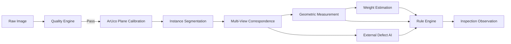

# Mandi Nyaay AI — Model Strategy & Vision Architecture

## 1. Architecture Overview
Mandi Nyaay strictly separates **Observation** (what visual patterns are seen) from **Measurement** (what geometry calculates) and **Decision** (what rules mandate).



---

## 2. Instance Segmentation Strategy

### 3-Tier Baseline Comparison
We will benchmark three distinct tiers of instance segmentation on the held-out test split of **Dataset A**:

| Tier | Candidate Architecture | Primary Role | Pros | Cons / Risks |
|---|---|---|---|---|
| **Tier 1: Classical CV Baseline** | Adaptive thresholding + Distance Transform + Marker-Controlled Watershed | Deterministic baseline & ultra-low-compute fallback | Zero GPU/NPU requirement; 100% deterministic; zero weight storage | Prone to oversegmentation or undersegmentation on touching onions with skin tears |
| **Tier 2: Lightweight Learned Mobile Baseline** | Permissively licensed lightweight detector (e.g. MobileNetV3-FPN / RT-DETR / custom TorchVision Mask R-CNN lite) | Primary deployable on-device mobile model | Fast inference (<150ms on mobile NPU/CPU); compact size (<25MB); clean permissive license | Requires real training data; boundary precision needs verification on touching contours |
| **Tier 3: Strong Research Baseline** | Meta SAM 2 (Segment Anything 2) / Detectron2 Mask R-CNN ResNet-50 | Silver-standard pseudo-labeling and research ceiling | High boundary fidelity; zero-shot promptability for edge cases | Too heavy for mobile edge deployment without distillation (>300MB, high latency) |

### Model Selection Criteria (Non-Negotiable)
1. **Held-Out Mask IoU**: Mean Intersection-over-Union $\ge 0.88$ on held-out field test set.
2. **Boundary Precision & Recall**: Strict boundary alignment to avoid diameter distortion.
3. **Split / Merge Error Rate**: Must track under-segmentation (two onions merged as one) and over-segmentation (single onion split into multiple). Merges cause false size/weight spikes.
4. **On-Device Profile**: Memory footprint $< 300\text{ MB}$, model artifact $< 35\text{ MB}$, inference latency $< 500\text{ ms}$ on Android midrange CPU/NPU.
5. **Licensing**: Permissive license (Apache-2.0, BSD-3, MIT) for all deployable runtime weights.

---

## 3. Multi-View Correspondence Engine
Onions on an inspection tray are observed across three canonical camera views: `TOP`, `SIDE`, and `UNDERSIDE`.

### Mathematical Formulation
Multi-view association is framed as a **constrained linear sum assignment problem** (bipartite matching via Hungarian algorithm):
$$\min \sum_{i} \sum_{j} C_{ij} X_{ij}$$
Subject to:
- One-to-one mapping constraints ($\sum_j X_{ij} \le 1$, $\sum_i X_{ij} \le 1$)
- Hard geometric feasibility constraints (e.g., area ratio between views must be within $[0.5, 2.0]$)

### Feature Vector Composition
The pairwise cost $C_{ij}$ combines:
1. **Area Consistency**: Difference in normalized planar area.
2. **Aspect Ratio Match**: Ratio of major-to-minor axis consistency.
3. **Color & Skin Texture Histogram**: Earth Mover's Distance / Bhattacharyya distance between HSV/Lab color distributions.
4. **Learned Visual Embedding** (Phase 4+): Cosine distance between normalized feature vectors extracted by a lightweight backbone.

### Ambiguity Handling
If the cost margin between the best match and second-best match is below a validated threshold $\tau_{\text{margin}}$, the system refuses to guess and emits:
```
VIEW_CORRESPONDENCE_UNCERTAIN -> MANUAL_REVIEW
```

---

## 4. Metric Measurement Engine
Measurements are derived deterministically using projective geometry, never hallucinated by neural networks.

1. **Planar Homography**: The detected ArUco marker corners define a planar homography matrix $H$ mapping image pixels $(u, v)$ to tray plane metric coordinates $(X_{\text{tray}}, Y_{\text{tray}})$ in millimetres:
   $$\begin{bmatrix} X \\ Y \\ 1 \end{bmatrix} \sim H \begin{bmatrix} u \\ v \\ 1 \end{bmatrix}$$
2. **Equatorial Diameter Estimation**:
   - Extract segmented contour points $\mathcal{P} = \{(u_k, v_k)\}$.
   - Transform contour to metric plane $\mathcal{P}_{\text{metric}} = \{H(u_k, v_k)\}$.
   - Fit minimum-area bounding rotated rectangle and minimum enclosing ellipse.
   - Extract maximum equatorial diameter ($D_{\max}$) and minimum equatorial diameter ($D_{\min}$) in millimetres.
3. **Uncertainty Bounds**: Compute 95% confidence intervals based on sub-pixel corner variance and homography reprojection residuals.

---

## 5. Weight Estimation Engine
Weight cannot be directly measured by an RGB camera; it is an inferred physical property modeled from visual geometry.

### Model Formulation
1. **Geometric Volumetric Proxy**: An onion is modeled approximately as a triaxial ellipsoid or prolate spheroid:
   $$V_{\text{est}} = \frac{\pi}{6} \cdot D_{\text{major}} \cdot D_{\text{minor}} \cdot H_{\text{polar}}$$
2. **Density Function**:
   $$\widehat{W} = \rho(\text{variety}) \cdot V_{\text{est}}^\alpha$$
   Where $\rho$ is the variety-specific density coefficient and $\alpha$ is an empirical scaling factor determined via log-linear regression on **Dataset D**.
3. **Evaluation Metrics**:
   - Mean Absolute Error (MAE) in grams
   - Root Mean Square Error (RMSE) in grams
   - Mean Absolute Percentage Error (MAPE)
   - Size-stratified bias (small, medium, large)
4. **Safeguard**: Until calibrated on $\ge 500$ physically weighed specimens from the target variety, the weight field remains `None` and status outputs `WEIGHT_ESTIMATION_UNCALIBRATED`.

---

## 6. External Defect AI Engine
Defect recognition is treated as a localized multi-label detection and classification task.

### Canonical Classes
`SPROUTING`, `SURFACE_ROT`, `MOULD`, `CUT_BRUISE`, `DEFORMITY`, `UNDERSIZED`, `NONE`.

### Architecture
- Input: Cropped, normalized image of each segmented onion entity across available views.
- Model: Permissively licensed convolutional/attention backbone with multi-label classification head.
- Output: For each defect class $c$:
  - Raw logit score $z_c \in (-\infty, \infty)$
  - Calibrated probability $p_c = \sigma(T \cdot z_c)$ (calibrated via temperature scaling on held-out validation set)
  - Heatmap / bounding box locating the damaged tissue.
- **Strict Policy Separation**: The model outputs only observed probabilities and regions. The **Procurement Rule Engine** decides whether a $15\%$ surface cut constitutes `URS` or `REJECT`.
