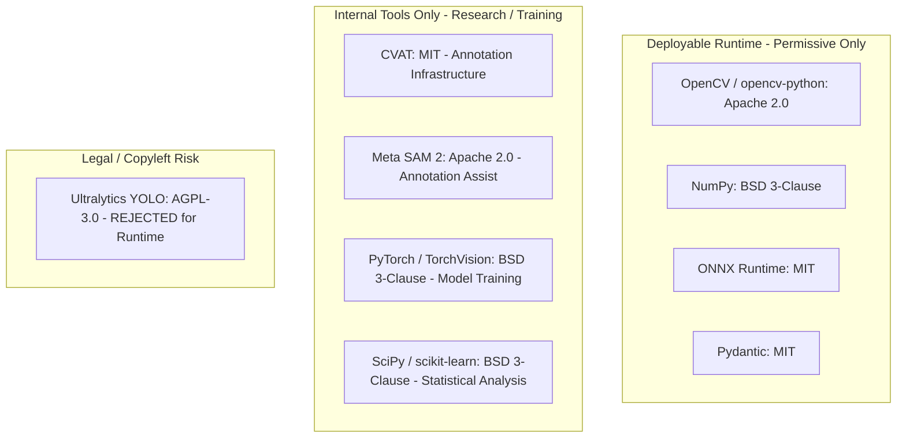

# Mandi Nyaay AI — Open-Source Components & Licensing Strategy

## 1. Open-Source Component Evaluation & Strategy

We reuse mature, well-tested open-source libraries to avoid reinventing established mathematical and computer vision primitives, while maintaining strict legal and operational control over dependencies.

---

## 2. Component Evaluation Matrix

| Library / Tool | Upstream Version | License | Target Layer | Why It Is Used | Legal / Licensing Implication |
|---|---|---|---|---|---|
| **OpenCV** (`opencv-python`) | `5.0.0.93` (or `4.9.0+`) | Apache 2.0 | Core Engine (CV / Geometry) | Industry-standard implementation of ArUco marker detection, planar homography, perspective transforms, ellipse fitting, and image I/O. | Permissive. Can be statically/dynamically linked and distributed in proprietary or open commercial products without copyleft constraints. |
| **NumPy** (`numpy`) | `2.5.3` (or `1.26+`) | BSD 3-Clause | Core Engine (Math) | Fundamental array structures and linear algebra routines for coordinate transformations. | Permissive. Attribution required in notices. |
| **Pydantic** (`pydantic`) | `2.13.5` | MIT | Core Engine (Domain Contracts) | Strict type enforcement, schema validation, serialization, and prevention of untyped/fabricated data leaks. | Permissive. Attribution required. |
| **PyYAML** (`pyyaml`) | `6.0.3` | MIT | Configuration | Safe YAML parsing for external configuration parameters. | Permissive. Attribution required. |
| **PyTorch & TorchVision** | `2.4.0+` | BSD 3-Clause | Training / Research | Model architecture definition, training loops, weight optimization, and baseline benchmarks. | Permissive. Kept primarily in training pipeline; exported to ONNX/TFLite for mobile runtime. |
| **Meta SAM 2** | `v1.0` (commit `c2ec...`) | Apache 2.0 | Annotation Acceleration | Promptable mask proposal tool inside CVAT to accelerate manual annotation of complex onion clusters. | Permissive Apache 2.0. Used strictly in internal annotation pipeline; not bundled in mobile runtime. |
| **CVAT** | `2.18+` | MIT | Data Platform | Enterprise-grade web annotation tool with multi-annotator workflows, task assignment, and COCO export. | Permissive. Standalone tool; zero runtime coupling with Mandi Nyaay core. |
| **ONNX Runtime** | `1.19+` | MIT | On-Device Mobile Engine | Lightweight, highly optimized cross-platform execution engine for mobile CPU/GPU/NPU inference on Android. | Permissive. Perfect for offline mobile edge deployment. |

---

## 3. Strict License Guardrails & Prohibitions

### The AGPL-3.0 Warning (e.g., Ultralytics YOLOv8 / YOLOv11)
* **Risk Analysis**: Ultralytics models (YOLOv8, YOLOv11) are licensed under the **GNU Affero General Public License v3.0 (AGPL-3.0)**. Incorporating AGPL-3.0 code or model artifacts into a commercial or institutional product distribution requires releasing the entire surrounding codebase under AGPL-3.0, including client and backend systems.
* **Architecture Decision**: **Ultralytics YOLO is strictly rejected for the deployable runtime.**
* **Alternative Approaches**:
  1. Use **RT-DETR** or **TorchVision Mask R-CNN** (Apache-2.0 / BSD-3).
  2. Implement a custom lightweight instance segmentation head trained via PyTorch (BSD-3).
  3. Export learned weights exclusively to standard ONNX formats without relying on GPL/AGPL runtime packages.

### Rules for Adding New Dependencies
1. **License Audit**: Must be audited for permissive licensing (MIT, Apache 2.0, BSD, ISC).
2. **Interface Isolation**: Every external library must sit behind an abstract domain interface in `app/cv/` or `app/pipeline/` (no leaking third-party types directly into core domain models).
3. **Pinning**: All versions must be pinned exactly in `pyproject.toml` and lockfiles.
4. **Third-Party Notices**: Every library must be credited in [`THIRD_PARTY_NOTICES.md`](file:///c:/Users/S/OneDrive/Desktop/AI/THIRD_PARTY_NOTICES.md).
