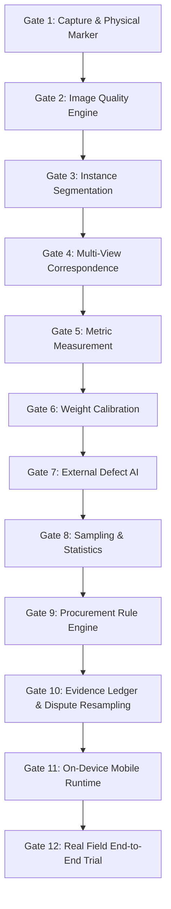

# Mandi Nyaay AI — Product Execution Plan

## 1. Executive Summary & Product Objective
Mandi Nyaay is an objective, offline-first agricultural inspection intelligence core designed for onion procurement at mandis, institutional collection centres, and farm gates. 

The system does **not** exist to "showcase AI." Its operational purpose is to:
1. **Reduce inspector manual effort** in counting, sizing, defect observation, and record-keeping.
2. **Eliminate subjective, inconsistent grading** across different mandis, inspectors, and market conditions.
3. **Establish auditable evidence** for every inspection to enable fair dispute resolution.
4. **Operate 100% offline** on edge mobile hardware (Android) in low-connectivity mandi environments.

### Core Philosophy
* **AI Observes**: Learned models propose visual candidates (instances, defects).
* **Geometry Measures**: Deterministic computer vision calculates real physical dimensions.
* **Statistics Quantify Uncertainty**: Sample size, variance, and confidence intervals define precision.
* **Rule Engine Interprets**: Transparent, versioned procurement rules determine grades.
* **Human Review Resolves**: Inspectors maintain ultimate authority over borderline/disputed cases.
* **Evidence Ledger Preserves**: Tamper-evident, replayable event chains document all actions.

---

## 2. The 12 Hard Acceptance Gates
No capability is marked "VALIDATED" or "COMPLETE" simply because code compiles or unit tests pass. Each phase must clear a hard acceptance gate backed by genuine field data, reproducible scripts, held-out evaluation, and failure documentation.

### Gate Specification Matrix

| Gate | Title | Objective | Hard Exit Criteria |
|---|---|---|---|
| **Gate 1** | **Real Capture & Physical Marker** | Robust detection of physical scale reference on tray plane | Real field image detection; sub-pixel corner validation; caliper-verified scale factor; explicit failure under occlusion or extreme tilt. |
| **Gate 2** | **Image Quality Engine** | Deterministic detection of blur, exposure, glare, and improper framing | Quantitative blur (Laplacian variance), exposure clipping, and luma computation; verified on sharp vs blurred/overexposed field captures; zero hardcoded fake metrics. |
| **Gate 3** | **Instance Segmentation** | Separation and boundary delineation of individual onions | Real dataset (touching, overlapping, varied sizes); held-out mask IoU, boundary precision/recall, split/merge error tracking; human-in-the-loop fallback for inseparable clusters. |
| **Gate 4** | **Multi-View Correspondence** | Association of top, side, and underside views for each physical onion | Constrained assignment formulation; evaluation of correct-match, false-match, and ambiguous rates; explicit `VIEW_CORRESPONDENCE_UNCERTAIN` state. |
| **Gate 5** | **Metric Measurement** | Planar equatorial diameter and shape metrics | Caliper-validated diameter ground truth; clear distinction between pixel measurements and planar metric measurements; error bounds surfaced per onion. |
| **Gate 6** | **Weight Calibration** | Deterministic/learned weight estimation from visual geometry | Trained exclusively against scale-weighed physical onions; MAE, RMSE, and bias evaluated by size/variety; uncalibrated state emits `WEIGHT_ESTIMATION_UNCALIBRATED`. |
| **Gate 7** | **External Defect AI** | Classification of canonical external defect classes | Ground-truth localized annotations; raw model score separated from calibrated confidence; mandatory limitation disclaimer ("External RGB only; internal quality unobserved"). |
| **Gate 8** | **Sampling & Statistics** | Sample sufficiency, lot variance, and confidence intervals | Statistical sample sizing based on lot size and variance; confidence intervals for grade distributions; explicit recording of inspector bag selection. |
| **Gate 9** | **Procurement Rule Engine** | Deterministic grading according to official specifications | Versioned rule packs (e.g., AGMARK, NAFED); canonical grades: `GRADE_A`, `URS`, `REJECT`, `MANUAL_REVIEW`; complete trace of rule inputs and thresholds. |
| **Gate 10** | **Evidence Ledger & Dispute** | Tamper-evident logging and blind re-sampling workflow | Cryptographic event chaining (hash of media + metadata + previous hash); replayable inspection state; blind resampling isolation (second inspector blinded to first run). |
| **Gate 11** | **On-Device Mobile Runtime** | Optimized offline inference on Android hardware | Export to ONNX/TFLite; memory < 500MB RAM; latency < 2.0s per tray capture; CPU/NPU validation; battery/thermal profiling. |
| **Gate 12** | **Real Field End-to-End Trial** | Live mandi operation trial under actual procurement conditions | Live field testing over ≥ 50 genuine farmer lots; inspector override rate tracking; dispute workflow test; reconciliation with certified weighbridge records. |

---

## 3. Strict Development Rules
1. **Never substitute synthetic data for real validation**: Synthetic tests may verify that data structures parse, but real CV capabilities require real physical imagery.
2. **Explicit Uncertainty Over Silent Interpolation**: When a measurement or detection is borderline, return `MANUAL_REVIEW` or `RETRY`. Never average or invent a plausible number.
3. **No Monolithic Leaks**: The AI core remains completely decoupled from Flutter, Android UI, backend databases, and server frameworks. Integration is governed by versioned JSON schemas.
4. **Permissive Open-Source Reuse**: Leverage mature libraries (OpenCV, CVAT, PyTorch, ONNX Runtime) under Apache-2.0, MIT, and BSD licenses. Avoid viral copyleft (GPL/AGPL) in deployable runtime code.
