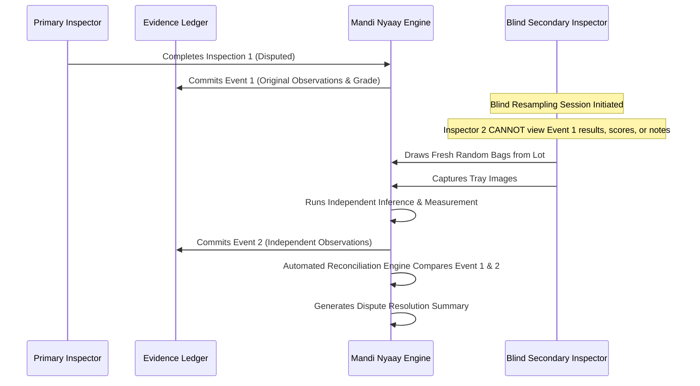

# Mandi Nyaay AI — Validation Strategy & Quality Gates

## 1. Foundation Tests vs Real Vision Validation
A critical engineering distinction is maintained between software unit correctness and field computer vision performance:

```
┌────────────────────────────────────────────────────────┐
│                   TEST CATEGORIZATION                  │
├───────────────────────────┬────────────────────────────┤
│     FOUNDATION TESTS      │   REAL VISION VALIDATION   │
├───────────────────────────┼────────────────────────────┤
│ • Pydantic schema parsing │ • Precision/recall on real │
│ • JSON roundtrip fidelity │   field images             │
│ • State machine enum logic│ • Caliper-benchmarked size │
│ • Mock / synthetic arrays │ • Scale-benchmarked weight │
│ • Missing file handling   │ • Ambient lighting drift   │
│ • Geometry math functions │ • Held-out mandi accuracy  │
└───────────────────────────┴────────────────────────────┘
```
**Rule**: Passing unit tests confirms that the code does not crash; it **never** proves that the CV algorithms work in the field.

---

## 2. Gate Verification Protocols

### Gate 1: Physical Reference & Marker Validation
* **Protocol**: Evaluate on $\ge 50$ real captures featuring physical ArUco markers (`DICT_4X4_50`, ID 0, $50.0\text{ mm}$).
* **Success Criteria**:
  - $100\%$ detection rate for markers with pitch/roll $< 30^\circ$ and clear visibility.
  - Sub-pixel corner repeatability standard deviation $< 0.8\text{ px}$.
  - Correct rejection (`CALIBRATION_INVALID` / `GEOMETRY_INVALID`) under partial occlusion ($> 25\%$), extreme tilt ($> 45^\circ$), or distorted aspect ratios ($> 3.0$).
  - Measured planar scale factor error $< 1.0\%$ relative to caliper ground truth.

### Gate 2: Image Quality Validation
* **Protocol**: Benchmarked on an intentional dual-capture dataset containing paired sharp vs blurred, correctly exposed vs over/underexposed images.
* **Success Criteria**:
  - Zero false positives on sharp, correctly exposed captures (`ACCEPT`).
  - $100\%$ rejection of severe motion blur ($\ge 10\text{ px}$ blur radius) with `RETRY` and failure code `BLUR_EXCEEDED`.
  - $100\%$ detection of clipping ($> 8\%$ over/underexposed pixels) with `RETRY` and failure code `UNDEREXPOSED` / `OVEREXPOSED`.

---

## 3. Calibration Drift Monitoring
To guarantee physical measurement consistency over time and across devices:
1. **Physical Reference Routine**: Each inspection shift begins with a calibration check using a certified physical reference disc (known diameter $50.0\text{ mm} \pm 0.05\text{ mm}$).
2. **Drift Metrics**:
   $$\text{Error}_{\text{abs}} = |D_{\text{observed}} - D_{\text{known}}|$$
   $$\text{Error}_{\text{rel}} = \frac{|D_{\text{observed}} - D_{\text{known}}|}{D_{\text{known}}} \times 100\%$$
3. **Thresholds**:
   - $\text{Error}_{\text{rel}} \le 1.5\%$: Calibration valid (`VALID`).
   - $1.5\% < \text{Error}_{\text{rel}} \le 3.0\%$: Warning flagged (`MANUAL_REVIEW`).
   - $\text{Error}_{\text{rel}} > 3.0\%$: Calibration halted (`CALIBRATION_INVALID`); prompt camera lens cleaning or tray re-alignment.

---

## 4. Weighbridge Cross-Check Engine
The weighbridge cross-check reconciles the aggregate sample weight distribution against the official certified weighbridge weight of the procurement truck/lot.

### Core Formulation
Given a lot with certified net weighbridge weight $W_{\text{certified}}$ and total estimated bag count $N_{\text{bags}}$:
1. Calculate the estimated lot weight from sampling:
   $$\widehat{W}_{\text{lot}} = N_{\text{bags}} \times \overline{W}_{\text{bag}} \pm 1.96 \cdot \frac{s_{\text{bag}}}{\sqrt{n_{\text{sampled}}}}$$
2. Reconciliation Test:
   Check whether $W_{\text{certified}}$ falls within the statistical tolerance interval $[\widehat{W}_{\text{lower}}, \widehat{W}_{\text{upper}}]$.

### Mandatory Terminology & Guardrail
* If $W_{\text{certified}}$ falls outside the interval, emit:
  ```
  STATUS: REVIEW_SIGNAL
  MESSAGE: "Weighbridge weight deviates from sampled bag weight estimate by delta kg.
            This is a review signal, not proof of fraud."
  ```
* **Strict Legal Policy**: Never use terms like "fraud detected", "theft", or "tampering." This is an operational review signal to flag sampling bias or moisture weight loss.

---

## 5. Blind Dispute Resampling Protocol
When an inspection result is challenged by a farmer or procurement officer:



### Dispute Rules
1. **Complete Blinding**: The secondary inspector's interface must not reveal prior counts, measurements, defect scores, or inspector notes.
2. **Fresh Sampling**: Requires selecting independent bags from the lot.
3. **Reconciliation**:
   - If both sessions agree within statistical confidence bounds ($p > 0.05$), the decision is affirmed.
   - If variance exceeds tolerance, an automatic escalation to the Joint Mandi Arbitration Committee is logged in the ledger.

---

## 6. Evidence Ledger Integrity Verification
1. **Cryptographic Event Chaining**:
   Every inspection step generates an immutable event record:
   $$\text{Hash}_k = \text{SHA256}(\text{EventID}_k \,\|\, \text{Timestamp} \,\|\, \text{ActorID} \,\|\, \text{PayloadHash}_k \,\|\, \text{Hash}_{k-1})$$
2. **Replayability**: A standalone audit script `scripts/replay_ledger.py` can parse the ledger, verify cryptographic hash links, re-run deterministic rule engines, and confirm identical procurement grades without alteration.
3. **Product Claim**: The ledger is **tamper-evident and replayable**; it does not claim to be "tamper-proof" or decentralized blockchain theatre.
